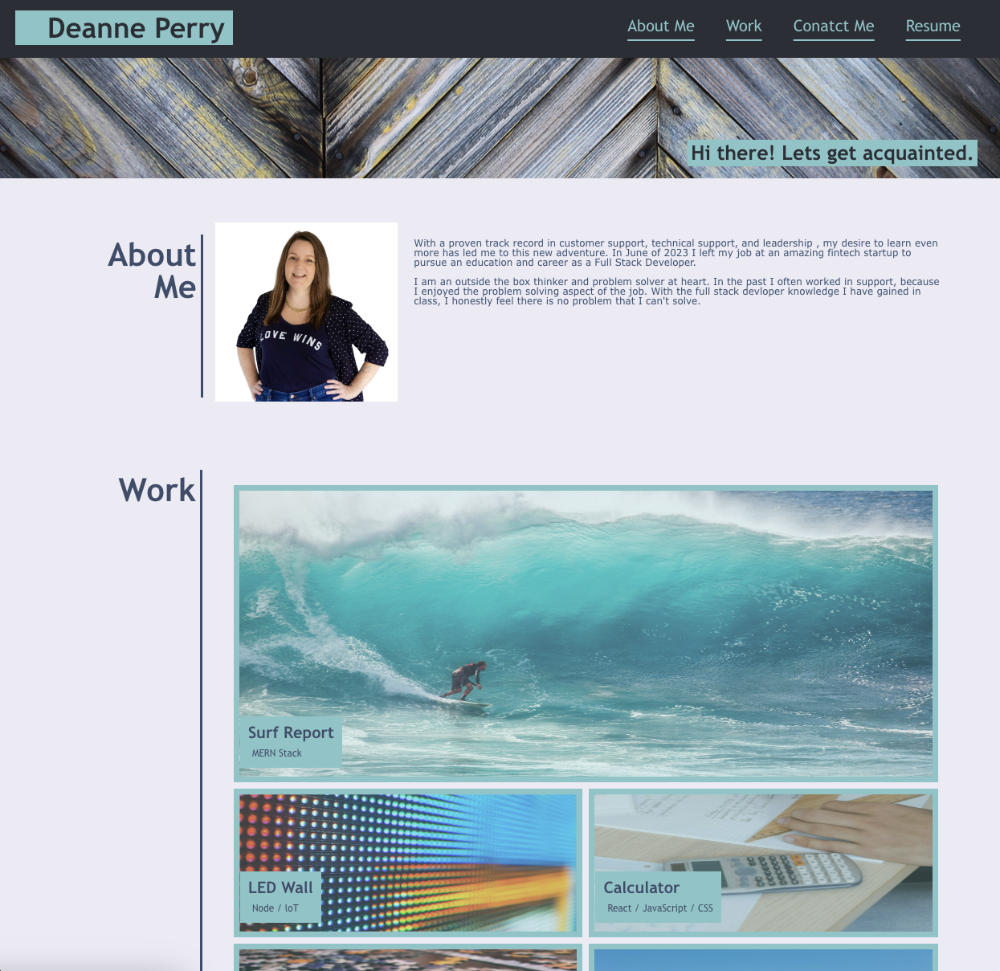

# AboutMe

The about me will serve as an introduction to potential employers. Here they can learn a bit about me, have access to some of my work as well as social and contact links. 

There are anchor links in the header's navigation bar to easily access the different sections onthe page as well a a link to download a recent copy of my resume. 

In the Work section, clicking on the images will direct you to the corrosponding webpage. These webpages are additional samples of my work and can also be accessed through my github link located in the Conatact Me section of this page. 

[The site has been publised](https://deannem1.github.io/AboutMe-Homework/)

My repository can be reviewed [here][def]

[def]: https://github.com/Deannem1/AboutMe-Homework

The following image shows my completed page:
